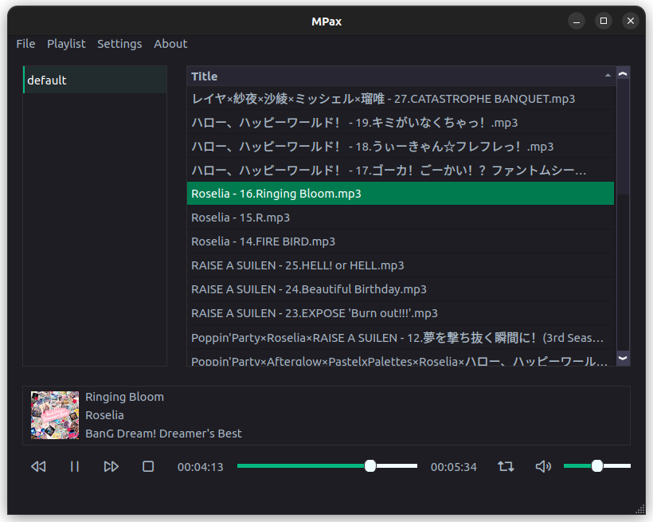

    

    <h1>
        
         
        MPax
    </h1>
    

    

        
        
        
        
        
    

English|[简体中文](./docs/README_zh_CN.md)

## Introduction

MPax is a simple and easy-to-use music player.

## Usage

* Default keymap
    - Play/Pause：``Ctrl+Meta+B``
    - Previous：``Ctrl+Meta+Left``
    - Next：``Ctrl+Meta+Right``
    - Step backward/forward：``Left``/``Right``
    - Open search window：``Ctrl+F``
* Search syntax（search in metadata）：
    * Title has abc：``title HAS abc``
    * Album name has abc and 123：``album HAS abc 123``

## TODO list

*
    * [ ] Music management.
    * [x] Basic music playing.
    * [x] Support .mp3/.flac/.wav.
    * [ ] **Support .cue**.
    * [ ] Show lyric.
    * [ ] **Mini window mode**.
    * [x] **Custom global shortcut**.
    * [ ] **Custom global shortcut in UI settings.**
    * [ ] Show music in different groups (artists, albums and so on).
*
    - [x] Playlist management.
    - [x] Add/Save/Delete playlist.
    - [x] **Export and import playlist.**
    - [x] Play history.
    - [x] Custom playlist header.
    - [x] **Sort by custom header**.
    - [x] **Move audio between playlists**.
    - [x] Manage audio file through playlists.
*
    - [x] Search.
    - [x] Filter search with syntax statement.
*
    - [x] Manage id3v2/id3v1 info.
*
    - [ ] Better encoding (if possible).

......

## Build from source

### Dependencies

* Qt5 >= 5.9
* GCC >= 4.7 (C++ 11)
* CMake >= 3.13

### Build steps

1.
    *

Ubuntu2204: ``sudo apt install g++ cmake qtbase5-dev qttools5-dev qtmultimedia5-dev libqt5x11extras5-dev qtbase5-dev qtchooser qt5-qmake qtbase5-dev-tools``
*
Ubuntu2004/Ubuntu1804: ``sudo apt install g++ cmake qtbase5-dev qttools5-dev qtmultimedia5-dev libqt5x11extras5-dev qt5-default``

5. Build *.deb

    * Ubuntu2204: ``./scripts/build_deb.sh -d Ubuntu2204``

    * Ubuntu2004: ``./scripts/build_deb.sh -d Ubuntu2004``
    * Ubuntu1804: ``./scripts/build_deb.sh -d Ubuntu1804``

## Releases

Releases are [here](https://github.com/realth000/MPax/releases).

## License

MPax is licensed under the term of GPL v3 license.

MPax uses the following libraries:

* [Qt](https://www.qt.io)

  Qt is the fastest and smartest way to produce industry-leading software that users love.

  Qt is licensed under GNU (L)GPL.

* [Skycoder42/QHotkey](https://github.com/Skycoder42/QHotkey)

  A global shortcut/hotkey for Desktop Qt-Applications.

  Licensed under the BSD-3-Clause license.

* [TagLib](https://taglib.org/)

  TagLib is a library for reading and editing the meta-data of several popular audio formats.

  TagLib is distributed under the GNU Lesser General Public License.

* [GTRONICK/QSS](https://github.com/GTRONICK/QSS)

  QT Style Sheets templates.

  Licensed under the MIT license.
