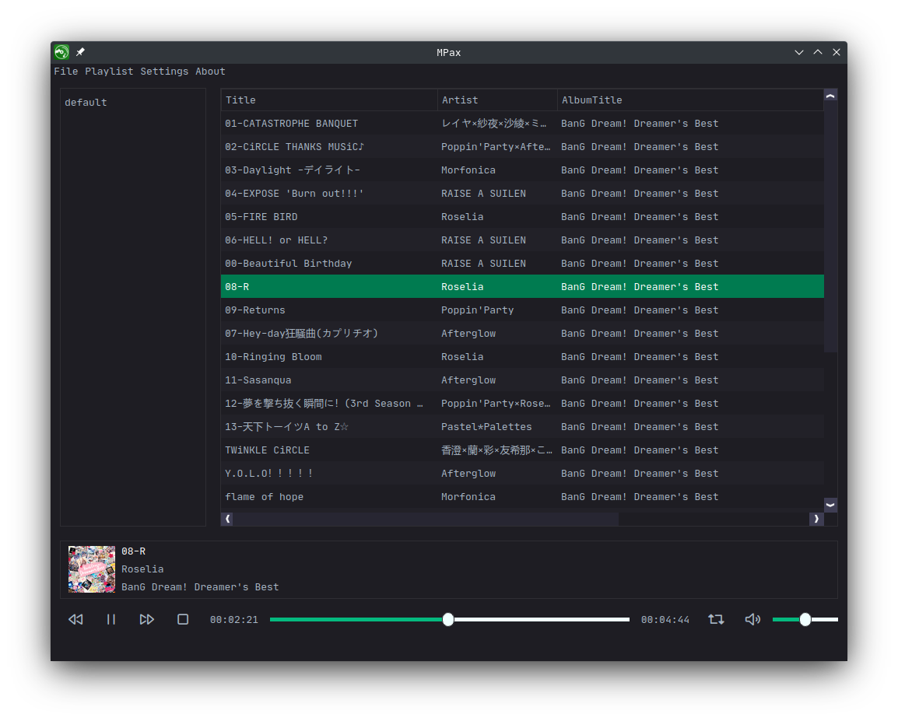

[中文文档](./docs/README_zh_CN.md)

---

## Introduction

MPax is a simple and easy-to-use music player.

Available on Linux, gradually optimize the experience on Windows.

## TODO List

* * [ ] Music management.
  * [x] Basic music playing.
  * [x] Support .mp3/.flac/.wav.
  * [ ] **Support .cue**.
  * [ ] Show lyric.
  * [ ] **A "small window" mode**.
  * [x] **Custom global shortcut**.
  * [ ] **Custom global shortcut in UI settings.**
  * [ ] Show music in different groups (artists, albums and so on).
* - [ ] Play list management.
  - [x] Add/Save/Delete play list.
  - [ ] **Export and import play lists.**
  - [x] Play history.
  - [ ] Custom play list header.
  - [x] **Sort by custom header**.
  - [ ] **Move audio between play lists**.
  - [x] Manage audio file through play list.
* - [ ] Search.
  - [x] Basic search.
  - [x] **Search with id3v2 info**.
  - [ ] **Search statement (for example, only search in title by "TITLE HAS xxx")**.
* - [ ] Manage id3v2/id3v1 info.
  - [x] **Read id3v2/id3v1 info**.
  - [ ] Modify id3v2/id3v1 info.
* - [ ] Better encoding (if possible).

......

## Build from source

### Dependencies

* Qt5 >= 5.15.1
* GCC >= 4.7 (C++ 11)
* CMake >= 3.13

### Build steps

1. ``sudo apt install g++ cmake qtbase5-dev qttools5-dev qtmultimedia5-dev libqt5x11extras5-dev qt5-default``
2. ``mkdir build && cd build``
3. ``cmake ../ && cmake --build . --target=all -j $(nproc)``
4. ``mkdir translation && cp -af ../resource/translation/*.qm translation/ # Install translations.``

## Release

Releases are [here](https://github.com/realth000/MPax/releases).

## License

MPax is licensed under the term of GPL v3 license.

MPax uses the following libraries:

* [Qt](https://www.qt.io)

  Qt is the fastest and smartest way to produce industry-leading software that users love.

  Qt is licensed under GNU (L)GPL.

* [Skycoder42/QHotkey](https://github.com/Skycoder42/QHotkey)

  A global shortcut/hotkey for Desktop Qt-Applications.

  Licensed under the BSD-3-Clause license.

* [TagLib](https://taglib.org/)

  TagLib is a library for reading and editing the meta-data of several popular audio formats.

  TagLib is distributed under the GNU Lesser General Public License.

* [GTRONICK/QSS](https://github.com/GTRONICK/QSS)

  QT Style Sheets templates.

  Licensed under the MIT license.
