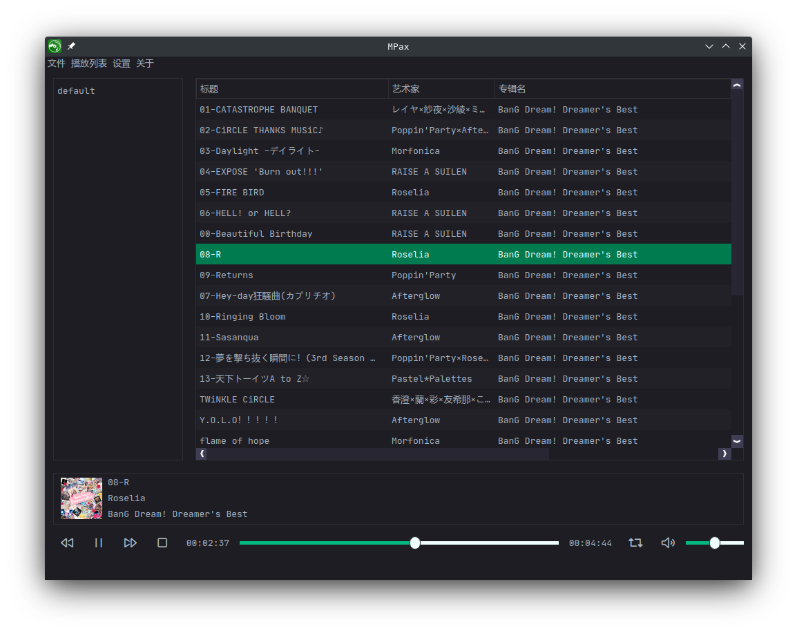

---

## 介绍

MPax是一款想在Linux平台上获得能对标foobar2000的顺畅体验的音乐播放器。

MPax主要想做本地音乐文件的管理（当然也播放），包括播放列表，搜索音乐，转换音乐格式。

MPax目前在Linux和Windows上可用，虽然如果是Windows的话推荐直接用foobar2000吧。

## TODO List

* * [ ] 音乐管理。
  * [x] 基本的音乐播放。
  * [x] 支持.mp3。
  * [ ] 支持.flac。
  * [ ] **支持.cue。**
  * [ ] 显示歌词。
  * [ ] **小窗模式。**
  * [ ] **自定义全局快捷键。**
  * [ ] 按组分组音乐（比如按歌手和专辑分类）。

* - [ ] 播放列表管理。
  - [x] 添加播放列表。
  - [x] 保存播放列表。
  - [ ] 删除播放列表。
  - [ ] **导出和导入播放列表（以m3u8格式或者不以）。**
  - [ ] 自定义播放列表行标题。
  - [x] **根据播放列表标题排序。**
  - [ ] **在播放列表之间移动文件。**
  - [ ] **播放列表中分组。**
  - [x] 在播放列表中管理文件。

* - [ ] 搜索。
  - [x] 基础搜索功能。
  - [ ] **搜索id3v2音乐标签**。
  - [ ] **搜索语法 （比如通过"TITLE HAS xxx"只在id3v2标签的标题中搜索）。**
* - [ ] 管理id3v2标签。
  - [ ] **读取id3v2标签。**
  - [ ] 修改id3v2标签。
  - [ ] 支持id3v1和id3v2.2到id3v2.4的版本。
* - [ ] 更好的解码（咕咕咕）。

......

## 从源码构建

MPax 需要以下依赖：

* Qt5 >= 5.15.1
* GCC >= 7.3 (C++ 11)
* CMake >= 3.13

## 版本

 [在这里](https://github.com/realth000/MPax/releases)。

## 版权

MPax 的开源协议是GPL v3。
